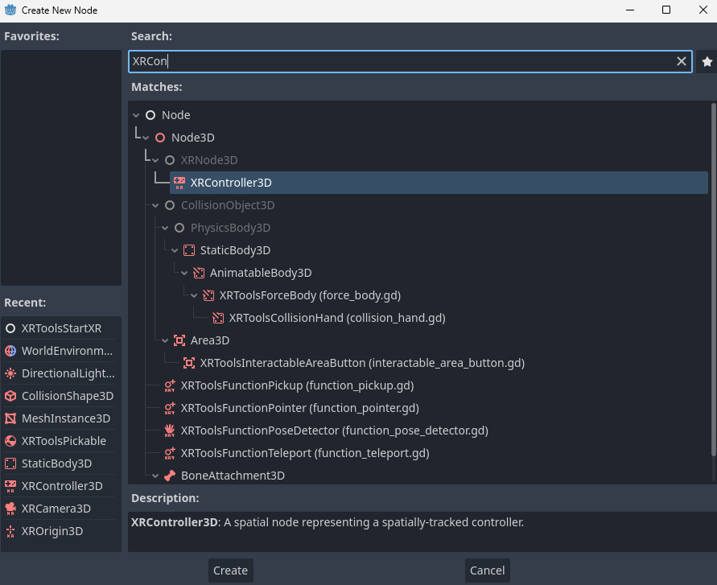
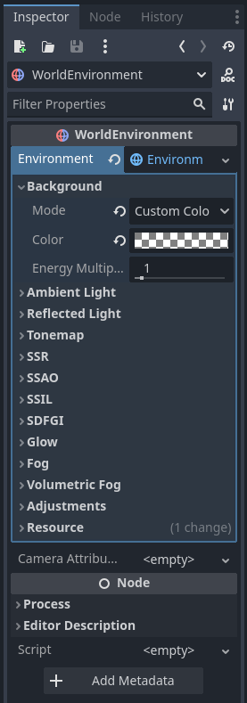
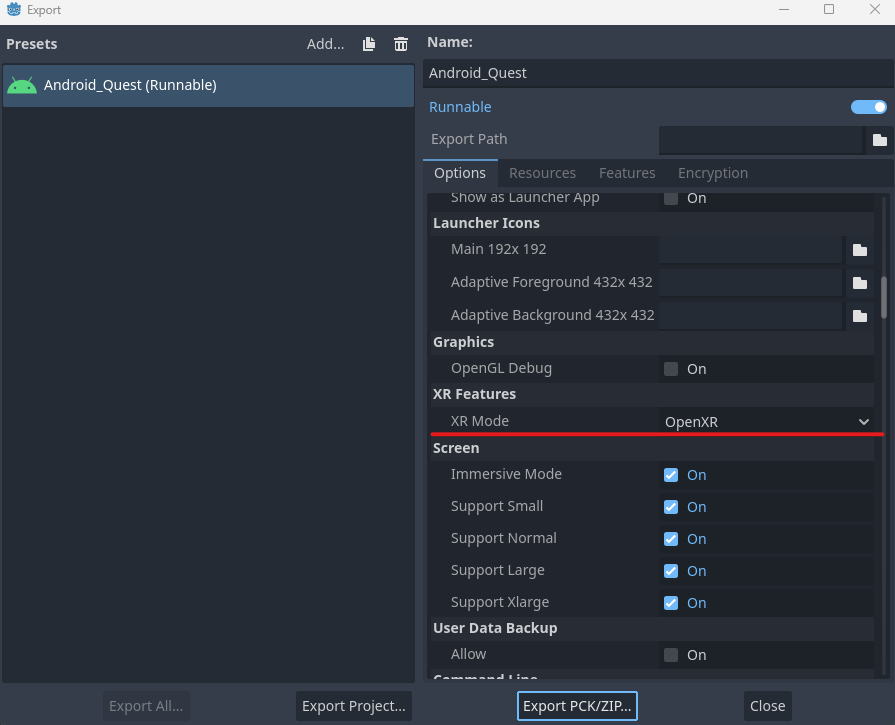

# Simple AR Game Tutorial - Unfinished

**Author:** *Shahriar Kariman*

**Godot Version:** *Godot 4.2.2*

## Required Tools & Software

Before you start making an AR game you need to have JDK 17 and android studio code installed on your device. Make sure once you have installed android studion that the command line tools are included in the sdk manager. Here are some screen shot to clarify that:


Note: It is very important that the version of java is JDK 17 from the start if you happen to have a version of Java installed on your machine uninstall it before installing android other wise you might need to edit some paths and clear some cache files and some other things.

## Getting Started

*Yipee* now the fun begins.

### Installing Godot XR Tools

Start a new Godot project like you would normally and be sure to set the renderer option to mobile. Then go to the asset library and install the godot xr tools plugin.


then go to the `project settings > plugins` and enable the plugin you just installed.

### Installing Godot OpenXR Loaders

To export the project you will eventually need the Godot XR loaders so might as well install it now.


### Project Settings

You will need to edit some of the project settings in the general tab search for **VRAM Compression** and enable the 2 options you see in the image bellow.


then in the general tab enable **OpenXR** and **Shaders**. And for OpenXR set the **environment blend mode** to alpha to be able to see through the environment.


Finally save and restart the project and you should be ready to put things together.

## Actual Game Development

Now lets make the game stuff, start with a 3D scene, rename it main and do a back flip. (you dont really have to do a back flip)

Then add an XR Origin node under main and a XRCamera3D under it.


Adjust the position of the camera based on the desired users height. (Move it up depending on how tall you are ~ 1.75)

Add 2 child XR Controller nodes to XR Origin then name one of them left_controller and the other the right_conroller.



For the both controllers on the inspector tab set the Pose property to aim and set the Tracker to left_hand for the left hand controller and right_hand for the right.

You should also adjust the position of the controllers based on body portions. (truth be told I am not sure if this step is necesery, I wonder if the headset would be able to just locate the controllers)


Now you can go to through the FileSystem and navigate to `res://addons/godot-xr-tools/hands/scenes/` and chose a set of hand scenes to drag under their accosiated left and right controller.

Now to add the pickup functionality to the controllers by navigating to `res://addons/godot-xr-tools/functions/` and draging the function_pickup scene under both controllers.

To add an object to pickup in the scene add an XRToolsPickable node and give it a collision shape and a mesh instance with the same size.


You should add a floor as static body or something to prevent the pickable node to fall forever and to be able to see the objects you will need to also add a directional light from above.

## World Environment & StartXR

In an AR game ou will need a see through environment to do this you should add a WorldEnvironment node.


From the inspector tab add a new environment to the WorldEnvironment node and set the background mode to a custom color and set the alpha channel of the color to 0 for transparency.



Now add a start_xr node to initialize the game when remote debugging to the headset and enable the pass through attribute in the inspector tab.


in the end your project should look like this:


## Exproting to Android

Oh this is the hardest part.

### Keystore File

If you already have android sdk and commandline tools installed then running this command will generate a keystore file.

```
keytool -keyalg RSA -genkeypair -alias androiddebugkey -keypass android -keystore debug.keystore -storepass android -dname "CN=Android Debug,O=Android,C=US" -validity 9999 -deststoretype pkcs12
```

trying running that command in your project directory.

Once you have the file in your project directory go to your editor settings and under the general tab find `Export > android` and edit the path to the keystore, the path to the android sdk and debug user name and password if necessery.

It is also a good idea to allow godot to clear the previous install in case the details of the export change otherwise Godot wont allow re-instalation.


Note: It goes without saying that the scene needs to be set as the main scene of the project.

### Getting Ready to Export

Now comes the last part bit.

### Android Build Template

You first need to install the android build template.


### New Android Export

Open the export window from `project > Export...` and make new export and name it whatever you like but make sure it is runnable.

Enable the gradle build option and the Godot Open Xr Meta plugin.


Then under XR Features set XR Mode to Open XR and set passthrough to optional (More on this bit later in the unsolved issues at the bottom of the document).



### Remote Debug to the Headset

Now to see the fruits of your labor hit remote debug (the option should be avalible in the same place you would go to run a regular godot project)


The project should build the download to the quest headset if there isn't an error and if there is you will know about it. (There are so many errors you could potentially have to deal with)

## Unsolve Issues/Mysteries

So the thing is in every document on the internet including [this one](https://docs.godotengine.org/en/stable/tutorials/xr/openxr_passthrough.html) on the Godot docs website there should be an atribute called passthrough in exports that needs to be set to optional for the game to open in passthrough in the headset but in version 4.2.2 I cant find this option anywhere I even opened up a discussion about it [here](https://godotforums.org/d/40167-xrfeatures-passthrough-export-property).

If you find out what the deal is with this thing let me know. Right now my project just opens as an empty windows in the headset and according to debugger there is not a single issue.